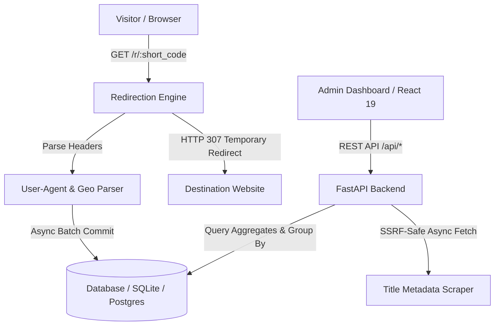

# ⚡ AuraLink

<div align="center">

> **High-Performance Full-Stack URL Shortener, UTM Campaign Studio & Real-Time Visitor Telemetry Platform.**

[](https://github.com/yourusername/auralink/actions)
[](https://python.org)
[](https://fastapi.tiangolo.com)
[](https://react.dev)
[](https://vitejs.dev)
[](docker-compose.yml)
[](LICENSE)
[](CONTRIBUTING.md)

[Quick Start](#-quick-start-with-docker-compose) • [Key Features](#-key-features) • [Architecture](#-system-architecture) • [API Reference](#-rest-api-reference) • [Security](#-security--defense-in-depth) • [Deployment](#-production-deployment)

</div>

---

## 🌟 Overview

**AuraLink** is an open-source, production-grade URL shortening and traffic intelligence platform. Built with **FastAPI**, **SQLAlchemy**, and **React 19**, it pairs sub-millisecond HTTP redirects with comprehensive visitor analytics—including real-time browser, operating system, device category, referrer channel, and geographic telemetry.

---

## ✨ Key Features

| Category | Highlights |
|---|---|
| 🚀 **High-Speed Redirection** | Non-blocking telemetry ingestion logging HTTP User-Agent, Referer, and IP headers before issuing HTTP 307 temporary redirects. |
| 📊 **Real-Time Telemetry** | Interactive 7-day velocity charts, browser distribution, operating system share, device categorization (Desktop/Mobile/Tablet/Bot), and live visitor streams. |
| 🏷️ **Custom Branding & Tags** | Custom aliases (e.g. `/r/summer-launch`), link categorization tags, auto page title scraping, and expiration presets (24h, 7d, 30d, permanent). |
| 🎯 **UTM Campaign Builder** | Visual campaign token builder (`utm_source`, `utm_medium`, `utm_campaign`, `utm_term`, `utm_content`) with 1-click URL injection. |
| 📦 **Bulk URL Shortener** | Batch shortening engine capable of processing up to 50 URLs in a single request with isolated validation. |
| 🎨 **QR Code Studio** | High-contrast QR codes with customizable palettes (Midnight, Cyber Indigo, Emerald, Sunset Amber, Rose Quartz) and high-res PNG export. |
| 📥 **Data Export Suite** | 1-click export of link registries and complete visitor telemetry in standard CSV format. |
| ⚡ **Traffic Simulator** | Built-in test simulator that generates synthetic visitor clicks across browsers, devices, and referrers for dashboard evaluation. |
| 🛡️ **Hardened Security** | SSRF prevention (DNS & private IP filtering), SQL wildcard DoS escaping, protocol whitelisting, and strict security headers. |

---

## 🏗️ System Architecture



---

## 🚀 Quick Start with Docker Compose

The fastest way to run AuraLink with persistent storage and Nginx reverse proxy:

```bash
# 1. Clone repository
git clone https://github.com/yourusername/auralink.git
cd auralink

# 2. Start all services
docker compose up -d
```

- 🌐 **Dashboard UI**: [http://localhost:3000](http://localhost:3000)
- ⚙️ **FastAPI Backend**: [http://localhost:8000](http://localhost:8000)
- 📖 **Interactive Swagger Docs**: [http://localhost:8000/docs](http://localhost:8000/docs)

---

## 💻 Local Development Setup

### 1. Backend (FastAPI + SQLAlchemy)

```bash
cd backend

# Create virtual environment
python -m venv venv

# Activate virtual environment
# Windows:
.\venv\Scripts\activate
# Linux/macOS:
source venv/bin/activate

# Install dependencies
pip install -r requirements.txt

# Run server with auto-reload
python -m uvicorn app.main:app --host 0.0.0.0 --port 8000 --reload
```

### 2. Frontend (React 19 + Vite)

```bash
cd frontend

# Install dependencies
npm install

# Start Vite dev server
npm run dev
```

Dashboard will be live at `http://localhost:5173`.

---

## 🧪 Running the Test Suite

AuraLink maintains automated unit, integration, and security test coverage:

```bash
# Run backend pytest suite
cd backend
python -m pytest -v

# Run frontend linting & production build test
cd frontend
npm run lint
npm run build
```

---

## 🛡️ Security & Defense-in-Depth

AuraLink implements robust defense-in-depth security mechanisms:

1. **SSRF (Server-Side Request Forgery) Defense**:
   - Pre-flight DNS resolution before fetching HTML metadata.
   - Strict IP validation blocking private RFC 1918 ranges (`10.0.0.0/8`, `172.16.0.0/12`, `192.168.0.0/16`), loopback (`127.0.0.0/8`, `::1`), multicast (`224.0.0.0/4`), and cloud metadata (`169.254.169.254`).
2. **Protocol & Scheme Whitelisting**:
   - Only `http` and `https` protocols are permitted. Unsafe schemes (`javascript:`, `data:`, `file:`, `vbscript:`) are rejected.
3. **CRLF & Header Injection Mitigation**:
   - URL inputs are sanitized against newline (`\n`), carriage return (`\r`), and control characters.
4. **SQL Wildcard DoS Prevention**:
   - LIKE search parameters escape `%`, `_`, and `\` to prevent wildcard queries from causing full-table scans.
5. **Security Headers Middleware**:
   - Every response includes `X-Content-Type-Options: nosniff`, `X-Frame-Options: DENY`, `Referrer-Policy`, and `X-XSS-Protection`.

---

## 📡 REST API Reference

### Links API

| Method | Endpoint | Description |
|---|---|---|
| `POST` | `/api/links` | Create a shortened URL (supports alias, title, expiry, tags) |
| `POST` | `/api/links/bulk` | Batch shorten multiple URLs (up to 50 items) |
| `GET` | `/api/links` | List links with search, tags, `status_filter`, and `sort_by` |
| `GET` | `/api/links/{id_or_code}` | Fetch single link details |
| `PATCH` | `/api/links/{id}` | Update link metadata or toggle active state |
| `DELETE` | `/api/links/{id}` | Delete link and its click history |
| `GET` | `/api/links/export/csv` | Export entire link registry as CSV |
| `POST` | `/api/links/cleanup-expired` | Deactivate links whose expiration date has passed |

### Analytics & Telemetry API

| Method | Endpoint | Description |
|---|---|---|
| `GET` | `/api/analytics/overview` | Aggregated global stats, timeline, distributions, and recent clicks |
| `GET` | `/api/analytics/links/{id_or_code}` | Deep telemetry breakdown for a specific shortened link |
| `GET` | `/api/analytics/export/csv` | Export raw click events telemetry as CSV |
| `POST` | `/api/analytics/simulate` | Generate synthetic visitor traffic for evaluation |
| `GET` | `/api/health` | Healthcheck endpoint returning server time |

### Redirection Route

| Method | Endpoint | Description |
|---|---|---|
| `GET` | `/r/{short_code}` | Resolves short link, logs telemetry, returns HTTP 307 redirect |

---

## 🔧 Environment Variables

Configure via `.env` file in the root or backend directory:

| Variable | Default | Description |
|---|---|---|
| `APP_NAME` | `AuraLink - Custom Link Shortener & Analytics` | Application display title |
| `BASE_URL` | `http://localhost:8000` | Base URL used to prefix short links |
| `DATABASE_URL` | `sqlite:///./link_shortener.db` | SQLAlchemy database connection string |
| `CORS_ORIGINS` | `http://localhost:5173,...` | Allowed CORS origins for API requests |
| `SHORT_CODE_LENGTH` | `6` | Length of generated random short codes |

---

## 📂 Project Structure

```
auralink/
├── .github/
│   ├── workflows/
│   │   └── ci.yml               # Multi-version Python & Node CI
│   ├── ISSUE_TEMPLATE/          # Bug & Feature templates
│   └── PULL_REQUEST_TEMPLATE.md
├── backend/
│   ├── app/
│   │   ├── services/
│   │   │   ├── analytics.py     # Aggregation & timeline analytics
│   │   │   ├── shortener.py     # Base62 generator & SSRF defenses
│   │   │   └── user_agent.py    # Header & telemetry parser
│   │   ├── config.py            # Settings & CORS configuration
│   │   ├── database.py          # SQLAlchemy engine & session maker
│   │   ├── main.py              # FastAPI endpoints & middleware
│   │   ├── models.py            # Relational database models
│   │   └── schemas.py           # Pydantic validation schemas
│   ├── tests/
│   │   ├── test_api.py          # Functional endpoint tests
│   │   └── test_security.py     # SSRF & vulnerability tests
│   ├── Dockerfile               # Production multi-stage Python image
│   └── requirements.txt
├── frontend/
│   ├── src/
│   │   ├── components/
│   │   │   ├── AnalyticsView.jsx# Chart.js charts & telemetry feed
│   │   │   ├── ClicksFeed.jsx   # Live event stream
│   │   │   ├── LinkCreator.jsx  # Single/Bulk shortener & UTM builder
│   │   │   ├── LinkList.jsx     # Filterable link cards registry
│   │   │   ├── Navbar.jsx       # Glassmorphic top navigation
│   │   │   ├── QRCodeModal.jsx  # QR code studio with color themes
│   │   │   └── TrafficSim.jsx   # Synthetic traffic simulator
│   │   ├── services/api.js      # REST API client
│   │   ├── utils/helpers.js     # Formatters & clipboard helpers
│   │   ├── App.jsx              # Main dashboard view
│   │   └── index.css            # Design tokens & glassmorphism
│   ├── Dockerfile               # Node build -> Nginx alpine image
│   ├── nginx.conf               # Nginx reverse proxy configuration
│   └── package.json
├── docker-compose.yml           # Multi-container orchestration
├── CONTRIBUTING.md              # Contributor guide
├── CODE_OF_CONDUCT.md           # Contributor Covenant 2.1
├── SECURITY.md                  # Security disclosure policy
├── CHANGELOG.md                 # Version history
├── LICENSE                      # MIT License
└── README.md
```

---

## 🚀 Production Deployment

### Option 1: Docker Compose on VPS (DigitalOcean / Hetzner / AWS EC2)
```bash
docker compose up -d --build
```

### Option 2: Render / Railway / Fly.io
1. Set **Build Command**: `pip install -r backend/requirements.txt`
2. Set **Start Command**: `uvicorn app.main:app --host 0.0.0.0 --port $PORT`
3. Add environment variable `DATABASE_URL` pointing to PostgreSQL or persistent SQLite volume.

---

## 🤝 Contributing

Contributions are welcome! Please read our [Contributing Guidelines](CONTRIBUTING.md) and [Code of Conduct](CODE_OF_CONDUCT.md) before opening a pull request.

---

## 📄 License

This project is licensed under the **MIT License** - see the [LICENSE](LICENSE) file for details.
