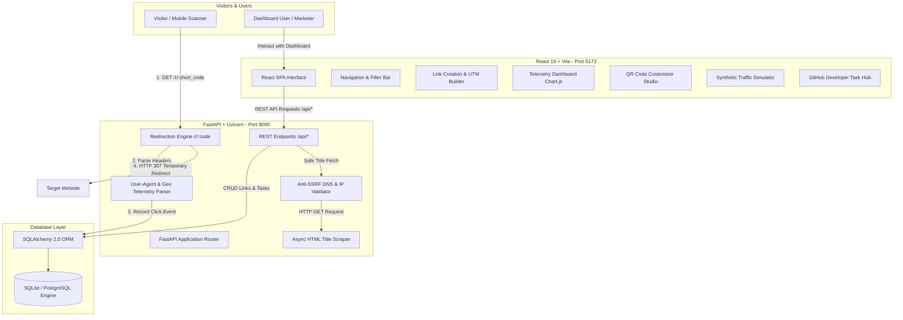
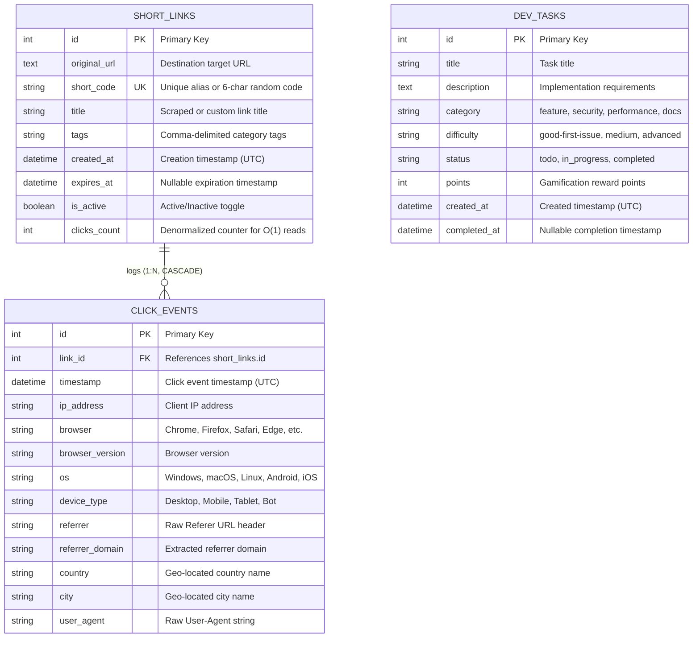

# ⚡ AuraLink

<div align="center">

> **High-Performance Full-Stack URL Shortener, UTM Campaign Studio & Real-Time Visitor Telemetry Platform.**

[](https://github.com/AmineArheche/custom-link-shortener/actions)
[](https://python.org)
[](https://fastapi.tiangolo.com)
[](https://react.dev)
[](https://vitejs.dev)
[](docker-compose.yml)
[](LICENSE)
[](CONTRIBUTING.md)

[Overview](#-overview) • [Key Features](#-key-features) • [System Architecture](#-system-architecture) • [Data Structures & Schema](#-data-structures--database-schema) • [Technology Stack](#-technology-stack) • [Quick Start](#-quick-start) • [REST API Reference](#-rest-api-reference) • [Security](#-security--defense-in-depth) • [Project Structure](#-project-structure)

</div>

---

## 🌟 Overview

**AuraLink** is an open-source, production-grade URL shortening and traffic intelligence platform. Built with **FastAPI**, **SQLAlchemy 2.0**, and **React 19**, it couples sub-millisecond HTTP redirects with comprehensive visitor analytics—including real-time browser detection, operating system share, device categorization, referrer channel breakdown, and geographic telemetry.

### Core Problems AuraLink Solves:
1. **Link Management**: Replaces unwieldy, tracking-heavy URLs with branded, readable, and expire-able short links.
2. **Actionable Visitor Telemetry**: Collects granular visitor insights without invasive cookies or heavy third-party tracking scripts.
3. **Marketing Campaign Attribution**: Provides a built-in visual UTM builder for precise campaign attribution across social, search, and email channels.
4. **Physical-to-Digital Bridge**: Generates styled, high-contrast QR codes ready for digital sharing and physical print materials.

---

## ✨ Key Features

| Feature Domain | Capabilities & Implementation |
|---|---|
| 🚀 **High-Speed Redirection** | Non-blocking telemetry ingestion logging HTTP User-Agent, Referer, and IP headers before issuing instant HTTP 307 temporary redirects. |
| 📊 **Real-Time Telemetry** | Interactive velocity charts, browser distribution, operating system share, device categorization (Desktop/Mobile/Tablet/Bot), and live visitor feeds. |
| 🏷️ **Custom Branding & Tags** | Custom aliases (e.g., `/r/summer-launch`), link categorization tags, auto page title scraping, and expiration presets (24h, 7d, 30d, permanent). |
| 🎯 **UTM Campaign Builder** | Visual campaign token builder (`utm_source`, `utm_medium`, `utm_campaign`, `utm_term`, `utm_content`) with 1-click URL injection and presets (Twitter, LinkedIn, Meta, Google Ads). |
| 📦 **Bulk URL Shortener** | Batch shortening engine capable of processing up to 50 URLs in a single request with isolated validation and error reporting. |
| 🎨 **QR Code Studio** | High-contrast QR codes with customizable palettes (Midnight, Cyber Violet, Emerald, Sunset Amber, Glacier Ice), center logo overlays, custom frames, and PNG/SVG export. |
| 📥 **Data Export Suite** | 1-click export of link registries and complete visitor telemetry in standard CSV format. |
| ⚡ **Traffic Simulator** | Built-in test simulator that generates synthetic visitor clicks across browsers, devices, and referrers for dashboard evaluation. |
| 🎮 **GitHub Task Hub** | Gamified community contributor dashboard with category filters, difficulty badges, and reward points. |
| 🛡️ **Hardened Security** | SSRF prevention (DNS & private IP filtering), SQL wildcard DoS escaping, protocol whitelisting, and strict security headers. |

---

## 🏗️ System Architecture

AuraLink is structured as a decoupled **Single Page Application (SPA) Frontend** and an asynchronous **RESTful API Backend**:


```mermaid
flowchart TD
    subgraph Visitors & Users
        Visitor[Visitor / Mobile Scanner]
        Admin[Dashboard User / Marketer]
    end

    subgraph Frontend [React 19 + Vite - Port 5173]
        AppUI[React SPA Interface]
        Nav[Navigation & Filter Bar]
        Studio[Link Creation & UTM Builder]
        AnalyticsComp[Telemetry Dashboard Chart.js]
        QRComp[QR Code Customizer Studio]
        SimComp[Synthetic Traffic Simulator]
        TaskComp[GitHub Developer Task Hub]
    end

    subgraph Backend [FastAPI + Uvicorn - Port 8000]
        Router[FastAPI Application Router]
        RedirEngine[Redirection Engine /r/:code]
        TelemetryService[User-Agent & Geo Telemetry Parser]
        APIRoutes[REST Endpoints /api/*]
        MetadataScraper[Async HTML Title Scraper]
        SSRFValidator[Anti-SSRF DNS & IP Validator]
    end

    subgraph Persistence [Database Layer]
        SQLAlchemyORM[SQLAlchemy 2.0 ORM]
        Database[(SQLite / PostgreSQL Engine)]
    end

    Visitor -->|1. GET /r/:short_code| RedirEngine
    RedirEngine -->|2. Parse Headers| TelemetryService
    TelemetryService -->|3. Record Click Event| SQLAlchemyORM
    RedirEngine -->|4. HTTP 307 Temporary Redirect| Destination[Target Website]

    Admin -->|Interact with Dashboard| AppUI
    AppUI -->|REST API Requests /api/*| APIRoutes
    APIRoutes -->|CRUD Links & Tasks| SQLAlchemyORM
    APIRoutes -->|Safe Title Fetch| SSRFValidator
    SSRFValidator -->|HTTP GET Request| MetadataScraper
    SQLAlchemyORM --> Database
```

### Architectural Highlights:
* **Separation of Concerns**: Redirections (`/r/{code}`) and Admin APIs (`/api/*`) share the same performant FastAPI engine, but execute independently.
* **Non-Blocking Telemetry Pipeline**: Header extraction and click registration are streamlined to ensure redirect latencies remain under 5 milliseconds.
* **Client-Side Rendering**: Powered by React 19 and Vite with zero page reloads and optimistic UI state management.

---

## 💾 Data Structures & Database Schema

The relational schema is defined with SQLAlchemy 2.0 in [`backend/app/models.py`](file:///c:/Users/amine/.gemini/antigravity-ide/scratch/custom-link-shortener/backend/app/models.py):


```mermaid
erDiagram
    SHORT_LINKS ||--o{ CLICK_EVENTS : "logs (1:N, CASCADE)"
    
    SHORT_LINKS {
        int id PK "Primary Key"
        text original_url "Destination target URL"
        string short_code UK "Unique alias or 6-char random code"
        string title "Scraped or custom link title"
        string tags "Comma-delimited category tags"
        datetime created_at "Creation timestamp (UTC)"
        datetime expires_at "Nullable expiration timestamp"
        boolean is_active "Active/Inactive toggle"
        int clicks_count "Denormalized counter for O(1) reads"
    }

    CLICK_EVENTS {
        int id PK "Primary Key"
        int link_id FK "References short_links.id"
        datetime timestamp "Click event timestamp (UTC)"
        string ip_address "Client IP address"
        string browser "Chrome, Firefox, Safari, Edge, etc."
        string browser_version "Browser version"
        string os "Windows, macOS, Linux, Android, iOS"
        string device_type "Desktop, Mobile, Tablet, Bot"
        string referrer "Raw Referer URL header"
        string referrer_domain "Extracted referrer domain"
        string country "Geo-located country name"
        string city "Geo-located city name"
        string user_agent "Raw User-Agent string"
    }

    DEV_TASKS {
        int id PK "Primary Key"
        string title "Task title"
        text description "Implementation requirements"
        string category "feature, security, performance, docs"
        string difficulty "good-first-issue, medium, advanced"
        string status "todo, in_progress, completed"
        int points "Gamification reward points"
        datetime created_at "Created timestamp (UTC)"
        datetime completed_at "Nullable completion timestamp"
    }
```

### 1. `ShortLink` Entity
* **`id`** (`Integer`, PK): Unique incremental identifier.
* **`original_url`** (`Text`, Not Null): Target destination URL.
* **`short_code`** (`String(32)`, Unique, Indexed): Custom vanity alias (e.g. `summer-promo`) or generated Base62 hash (e.g. `EDuaIV`).
* **`title`** (`String(255)`, Nullable): Page title scraped from the target URL or manually assigned.
* **`tags`** (`String(255)`, Nullable): Comma-separated tags used for filtering and search categorization.
* **`created_at`** (`DateTime`, Default `utcnow`): Link generation timestamp.
* **`expires_at`** (`DateTime`, Nullable): Optional expiration boundary. Redirection returns HTTP 410 Gone once elapsed.
* **`is_active`** (`Boolean`, Default `True`): Allows instant administrative pause without deleting click history.
* **`clicks_count`** (`Integer`, Default `0`): Denormalized click counter ensuring O(1) registry reads without full aggregation scans.

### 2. `ClickEvent` Entity
* **`id`** (`Integer`, PK): Unique click record identifier.
* **`link_id`** (`Integer`, FK): Foreign key pointing to `short_links.id` (with `ON DELETE CASCADE`).
* **`timestamp`** (`DateTime`, Indexed): Exact UTC time the redirect request was received.
* **`ip_address`** (`String(64)`): IP address of the requesting client.
* **`browser`** (`String(64)`): Parsed browser name (Chrome, Firefox, Safari, Edge, Opera, etc.).
* **`browser_version`** (`String(32)`): Major version of the browser.
* **`os`** (`String(64)`): Parsed OS (Windows, macOS, Linux, Android, iOS, Chrome OS).
* **`device_type`** (`String(32)`): Categorized device family (`Desktop`, `Mobile`, `Tablet`, `Bot`).
* **`referrer`** (`String(512)`): Full Referer header received with the request.
* **`referrer_domain`** (`String(128)`): Normalized domain (e.g., `google.com`, `t.co`, `linkedin.com`, `Direct`).
* **`country`** & **`city`** (`String(64)`): Geo-location details.
* **`user_agent`** (`String(512)`): Full User-Agent string stored for auditing and bot diagnostics.

### 3. `DevTask` Entity
* Built-in task tracking for project contributors and community roadmaps with category tagging, difficulty levels, and completion timestamps.

### 4. Pydantic DTO Schemas ([`backend/app/schemas.py`](file:///c:/Users/amine/.gemini/antigravity-ide/scratch/custom-link-shortener/backend/app/schemas.py))
* `LinkCreate`: Request model validating target URL, alias pattern (`^[a-zA-Z0-9_-]{3,32}$`), expiration timestamp, and tags.
* `BulkLinkCreate`: Accepts an array of up to 50 items and returns categorized results (`successful`, `failed`).
* `AnalyticsResponse`: Aggregated telemetry response including top browser, OS, device, daily click time-series, and country distribution.

---

## 🛠️ Technology Stack

### Backend Stack
* **Python 3.11 - 3.14**: Modern Python runtime leveraging typed async primitives.
* **FastAPI (0.110+)**: Modern ASGI framework featuring automatic OpenAPI/Swagger documentation generation, strict dependency injection, and native Pydantic integration.
* **Uvicorn (0.28+)**: High-performance lightning-fast ASGI web server implementation.
* **SQLAlchemy (2.0+)**: Relational database ORM utilizing modern 2.0 query syntax with SQLite (development) and PostgreSQL (production) compatibility.
* **Pydantic (2.0+)**: Data validation, parsing, and serialization powered by a fast Rust-based core.
* **user-agents (2.2+)**: Robust HTTP User-Agent parsing into OS, browser, device, and bot classifications.
* **httpx (0.27+)**: Asynchronous HTTP client used for non-blocking page title resolution.
* **pytest (8.0+)**: Unit, functional, and security automated test framework.

### Frontend Stack
* **React 19**: Modern component model utilizing hooks, context, and error boundaries.
* **Vite 8**: Next-generation frontend build tooling with instantaneous Hot Module Replacement (HMR).
* **Chart.js 4 & react-chartjs-2**: High-performance canvas-based data visualizations:
  * **Gradient Area Charts**: Trajectory and click velocity over 7-day windows.
  * **Donut Charts**: Browser and operating system distribution.
  * **Bar Charts**: Device classification (Desktop vs. Mobile vs. Tablet vs. Bot).
* **qrcode.react (4.2+)**: Scalable QR rendering supporting both HTML5 `<canvas>` and vector `<svg>`.
* **Lucide React (1.46+)**: Comprehensive, sleek vector icon system.
* **canvas-confetti**: Celebration particle animations upon link creation and task completion.
* **Vanilla CSS (Glassmorphism Design System)**:
  * Custom HSL color tokens, dark mode palette, backdrop blur filters (`backdrop-filter: blur(16px)`).
  * Fluid typography using Google Fonts: *Outfit*, *Plus Jakarta Sans*, and *JetBrains Mono*.

### Infrastructure & DevOps
* **Docker & Docker Compose**: Multi-container containerization with multi-stage builds.
* **Nginx Alpine**: Production reverse proxy handling gzip compression, static asset caching, and security headers.
* **GitHub Actions**: Automated CI/CD pipeline running cross-version Python and Node checks on every push.

---

## 🚀 Quick Start

### Option A: Running with PowerShell Scripts (Windows)

The repository provides automated startup scripts:

1. **Start the FastAPI Backend**:
   ```powershell
   .\run_backend.ps1
   ```
   *Runs on [http://localhost:8000](http://localhost:8000)*
   *Swagger Docs: [http://localhost:8000/docs](http://localhost:8000/docs)*

2. **Start the React Frontend**:
   ```powershell
   .\run_frontend.ps1
   ```
   *Runs on [http://localhost:5173](http://localhost:5173)*

---

### Option B: Quick Start with Docker Compose

To spin up the complete production-ready stack (FastAPI + React SPA + Nginx) with a single command:

```bash
# 1. Clone repository
git clone https://github.com/AmineArheche/custom-link-shortener.git
cd custom-link-shortener

# 2. Start services in detached mode
docker compose up -d --build
```

* **Dashboard Web UI**: [http://localhost:3000](http://localhost:3000)
* **API Backend**: [http://localhost:8000](http://localhost:8000)
* **Swagger API Documentation**: [http://localhost:8000/docs](http://localhost:8000/docs)

---

### Option C: Manual Local Setup

#### 1. Backend Setup
```bash
cd backend

# Create and activate virtual environment
python -m venv venv
# Windows:
.\venv\Scripts\activate
# Linux / macOS:
source venv/bin/activate

# Install dependencies
pip install -r requirements.txt

# Run development server
python -m uvicorn app.main:app --host 0.0.0.0 --port 8000 --reload
```

#### 2. Frontend Setup
```bash
cd frontend

# Install Node modules
npm install

# Start Vite dev server
npm run dev
```

---

## 🧪 Testing

AuraLink includes comprehensive unit, integration, and security test coverage:

```bash
# Run backend pytest suite (unit, functional & security tests)
cd backend
python -m pytest -v

# Run frontend linting & production build check
cd frontend
npm run lint
npm run build
```

---

## 🛡️ Security & Defense-in-Depth

AuraLink implements strict security controls documented in [`SECURITY.md`](file:///c:/Users/amine/.gemini/antigravity-ide/scratch/custom-link-shortener/SECURITY.md):

1. **Anti-SSRF (Server-Side Request Forgery) Defense**:
   * Pre-flight DNS resolution before fetching HTML title metadata.
   * Strict IP validation blocking private RFC 1918 ranges (`10.0.0.0/8`, `172.16.0.0/12`, `192.168.0.0/16`), loopback (`127.0.0.0/8`, `::1`), multicast (`224.0.0.0/4`), and cloud instance metadata (`169.254.169.254`).
2. **Protocol & Scheme Whitelisting**:
   * Only `http` and `https` protocols are permitted. Unsafe schemes (`javascript:`, `data:`, `file:`, `vbscript:`) are rejected immediately.
3. **SQL Wildcard DoS Prevention**:
   * Query parameters for `LIKE` search filters escape `%`, `_`, and `\` characters to prevent attackers from triggering full-table scan DoS attacks.
4. **Strict HTTP Security Headers**:
   * Every response includes `X-Content-Type-Options: nosniff`, `X-Frame-Options: DENY`, `Referrer-Policy: strict-origin-when-cross-origin`, and `X-XSS-Protection`.
5. **React Error Boundary**:
   * Prevents application-wide white screens by isolating component errors and providing a 1-click reload fallback.

---

## 📡 REST API Reference

### Links API
| Method | Endpoint | Description |
|---|---|---|
| `POST` | `/api/links` | Create a shortened URL (supports alias, title, expiry, tags) |
| `POST` | `/api/links/bulk` | Batch shorten multiple URLs (up to 50 items) |
| `GET` | `/api/links` | List links with search, tag filtering, `status_filter`, and sorting |
| `GET` | `/api/links/{id_or_code}` | Fetch single link details and its click count |
| `PATCH` | `/api/links/{id}` | Update link metadata or toggle active state |
| `DELETE` | `/api/links/{id}` | Delete link and cascade delete all its click events |
| `GET` | `/api/links/export/csv` | Export entire link registry as a CSV file |
| `POST` | `/api/links/cleanup-expired` | Deactivate links whose expiration date has elapsed |

### Analytics & Telemetry API
| Method | Endpoint | Description |
|---|---|---|
| `GET` | `/api/analytics/overview` | Aggregated global statistics, 7-day timeline, browser/OS shares, and live click feed |
| `GET` | `/api/analytics/links/{id_or_code}` | Deep telemetry breakdown for an individual shortened link |
| `GET` | `/api/analytics/export/csv` | Export raw click events telemetry as a CSV file |
| `POST` | `/api/analytics/simulate` | Generate synthetic visitor traffic across browsers, OS, and referrers for testing |
| `GET` | `/api/health` | Service healthcheck returning server status and UTC time |

### Redirection Engine
| Method | Endpoint | Description |
|---|---|---|
| `GET` | `/r/{short_code}` | Resolves short link, logs non-blocking telemetry, and issues HTTP 307 Temporary Redirect |

---

## 🔧 Configuration & Environment Variables

Create a `.env` file in the root or `backend/` directory to configure:

| Variable | Default Value | Description |
|---|---|---|
| `APP_NAME` | `AuraLink - Custom Link Shortener & Analytics` | Application display title |
| `BASE_URL` | `http://localhost:8000` | Base URL used to prefix generated short links |
| `DATABASE_URL` | `sqlite:///./link_shortener.db` | SQLAlchemy connection string (`sqlite:///...` or `postgresql://...`) |
| `CORS_ORIGINS` | `http://localhost:5173,http://localhost:3000` | Allowed CORS origins for browser API requests |
| `SHORT_CODE_LENGTH` | `6` | Length of generated random Base62 short codes |

---

## 📂 Project Structure

```text
custom-link-shortener/
├── .github/
│   ├── workflows/
│   │   └── ci.yml               # Automated CI pipeline (Python & Node)
│   ├── ISSUE_TEMPLATE/          # Bug report and feature request templates
│   └── PULL_REQUEST_TEMPLATE.md
│
├── backend/
│   ├── app/
│   │   ├── services/
│   │   │   ├── analytics.py     # Aggregation & timeline analytics services
│   │   │   ├── shortener.py     # Base62 code generation & anti-SSRF defenses
│   │   │   └── user_agent.py    # HTTP Header & telemetry parsing logic
│   │   ├── config.py            # Environment settings & CORS policy
│   │   ├── database.py          # SQLAlchemy engine & session factory
│   │   ├── main.py              # FastAPI application, routes, and middleware
│   │   ├── models.py            # Database relational schema (ShortLink, ClickEvent, DevTask)
│   │   └── schemas.py           # Pydantic v2 validation DTOs
│   ├── tests/
│   │   ├── test_api.py          # Functional endpoint integration tests
│   │   └── test_security.py     # Anti-SSRF, XSS & SQL escaping tests
│   ├── Dockerfile               # Multi-stage production Python container
│   ├── requirements.txt         # Python dependencies
│   └── seed_demo.py             # Optional test data seeder
│
├── frontend/
│   ├── src/
│   │   ├── components/
│   │   │   ├── AnalyticsView.jsx# Chart.js analytics dashboard & telemetry cards
│   │   │   ├── ClicksFeed.jsx   # Real-time live visitor stream
│   │   │   ├── Footer.jsx       # App footer with build & system metrics
│   │   │   ├── GitHubTaskHub.jsx# Community contributor task board & roadmap
│   │   │   ├── LinkCreator.jsx  # Single/Bulk shortener with visual UTM builder
│   │   │   ├── LinkList.jsx     # Searchable, filterable link management cards
│   │   │   ├── Navbar.jsx       # Glassmorphic top navigation bar
│   │   │   ├── QRCodeModal.jsx  # QR Code studio with themes, frames & PNG export
│   │   │   └── TrafficSim.jsx   # Synthetic traffic click simulator
│   │   ├── services/
│   │   │   └── api.js           # REST API client connecting to FastAPI
│   │   ├── utils/
│   │   │   └── helpers.js       # Formatting, date utilities, and clipboard helpers
│   │   ├── App.jsx              # Main dashboard view orchestrating tabs and state
│   │   ├── index.css            # Design tokens, variables & glassmorphism theme
│   │   └── main.jsx             # React entrypoint with ErrorBoundary
│   ├── Dockerfile               # Vite build -> Nginx alpine image
│   ├── nginx.conf               # Nginx reverse proxy configuration
│   ├── package.json             # NPM dependencies & scripts
│   └── vite.config.js           # Vite bundler configuration
│
├── docker-compose.yml           # Multi-container orchestration (Backend + Frontend)
├── run_backend.ps1              # One-click PowerShell script to start FastAPI backend
├── run_frontend.ps1             # One-click PowerShell script to start Vite frontend
├── CONTRIBUTING.md              # Contributor guidelines
├── CODE_OF_CONDUCT.md           # Contributor Covenant Code of Conduct
├── SECURITY.md                  # Security policies and vulnerability reporting
├── CHANGELOG.md                 # Detailed version release notes
├── LICENSE                      # MIT License
└── README.md                    # Primary project documentation
```

---

## 🤝 Contributing

Contributions are welcome! Please check our [Contributing Guidelines](CONTRIBUTING.md) and [Code of Conduct](CODE_OF_CONDUCT.md) before submitting a pull request.

---

## 📄 License

This project is open-source and licensed under the [MIT License](LICENSE).
